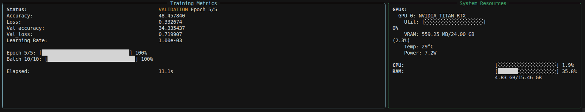

# Trainminal

A terminal-based ML/DL training monitor that provides real-time metrics, resource monitoring, and process management - all in your terminal, no web interfaces needed!



## Features

- **Real-time Metrics Display**: Losses, accuracy, learning rate, and custom metrics
- **Training Phases**: Track training, validation, and testing phases
- **Resource Monitoring**: GPU utilization, VRAM, RAM, and CPU usage
- **Progress Visualization**: Progress bars, ETA, and training speed
- **ASCII Plotting**: Real-time ASCII plots of metrics (loss curves, accuracy, etc.)
- **Process Management**: Easy process control and command history
- **Beautiful TUI**: Rich terminal interface with live updates
- **Clean Exception Display**: Exceptions shown cleanly with copy-pastable tracebacks
- **Easy Integration**: Works as decorator, context manager, or CLI wrapper

## Installation

```bash
pip install trainminal
```

## Quick Start

### Method 1: Context Manager (Recommended)

```python
from trainminal import Monitor
from trainminal.metrics import Phase

with Monitor() as mon:
    # Set training parameters
    mon.set_epoch(0, num_epochs=10)
    mon.set_learning_rate(0.001)
    
    for epoch in range(10):
        # Training phase
        mon.set_phase(Phase.TRAINING)
        mon.set_epoch(epoch, 10)
        
        for batch in range(num_batches):
            mon.set_batch(batch, num_batches)
            
            # Your training code here
            loss = train_step()
            
            # Log metrics
            mon.log_metric('loss', loss)
            mon.update_performance(batch_size=32)
        
        # Validation phase
        mon.set_phase(Phase.VALIDATION)
        val_loss = validate()
        mon.log_metric('val_loss', val_loss)
```

### Method 2: CLI Wrapper

```bash
# Run your training script with monitoring
trainminal run python train.py --epochs 10

# Redo the last command
trainminal redo

# Kill a training process
trainminal kill

# View command history
trainminal history
```

### Method 3: Decorator

```python
from trainminal import monitor

@monitor()
def train():
    # Your training code
    pass

train()
```

## Usage Examples

### PyTorch Example

```python
import torch
import torch.nn as nn
from trainminal import Monitor
from trainminal.metrics import Phase

with Monitor() as mon:
    model = YourModel()
    optimizer = torch.optim.Adam(model.parameters())
    criterion = nn.CrossEntropyLoss()
    
    num_epochs = 10
    mon.set_epoch(0, num_epochs)
    
    for epoch in range(num_epochs):
        mon.set_phase(Phase.TRAINING)
        mon.set_epoch(epoch, num_epochs)
        
        for batch_idx, (data, target) in enumerate(train_loader):
            mon.set_batch(batch_idx, len(train_loader))
            
            optimizer.zero_grad()
            output = model(data)
            loss = criterion(output, target)
            loss.backward()
            optimizer.step()
            
            mon.log_metric('loss', loss.item())
            mon.update_performance(batch_size=data.size(0))
        
        # Validation
        mon.set_phase(Phase.VALIDATION)
        val_loss = validate_model(model, val_loader)
        mon.log_metric('val_loss', val_loss)
```

### Manual API

```python
from trainminal import Monitor

mon = Monitor()
mon.start()

# Log metrics
mon.log_metric('loss', 0.5)
mon.log_metrics({'accuracy': 0.95, 'f1_score': 0.92})

# Set training state
mon.set_epoch(5, total_epochs=10)
mon.set_batch(100, total_batches=200)
mon.set_learning_rate(0.001)
mon.set_phase(Phase.TRAINING)

# Update performance
mon.update_performance(batch_size=32, batch_time=0.1)

mon.stop()
```

## Display Features

The terminal UI shows:

- **Training Status**: Current phase and epoch progress
- **Metrics**: All logged metrics with latest values
- **Progress Bars**: Visual progress for epochs and batches
- **GPU Monitoring**: Utilization, VRAM usage, temperature, power
- **System Resources**: CPU and RAM usage
- **Performance**: Samples/sec, batches/sec, ETA

## API Reference

### Monitor Class

```python
Monitor(
    use_tui: bool = True,           # Enable TUI mode
    refresh_rate: float = 0.5,      # Display refresh rate (seconds)
    log_file: Optional[str] = None,  # Optional log file path
    auto_detect: bool = True         # Auto-detect ML framework
)
```

### Key Methods

- `log_metric(name: str, value: float, step: Optional[int] = None)`: Log a single metric
- `log_metrics(metrics: dict, step: Optional[int] = None)`: Log multiple metrics
- `set_phase(phase: Phase)`: Set training phase (TRAINING/VALIDATION/TESTING/IDLE)
- `set_epoch(epoch: int, total_epochs: Optional[int] = None)`: Set current epoch
- `set_batch(batch: int, total_batches: Optional[int] = None)`: Set current batch
- `set_learning_rate(lr: float)`: Set learning rate
- `update_performance(batch_size: int, batch_time: Optional[float] = None)`: Update performance metrics
- `get_plot(metric_name: str, title: Optional[str] = None)`: Get ASCII plot for a metric
- `get_plots(metric_names: list, title: Optional[str] = None)`: Get multiple plots side by side

## CLI Commands

- `trainminal run <command>`: Run a command with monitoring
- `trainminal redo`: Redo the last command
- `trainminal kill [--pid PID]`: Kill a training process
- `trainminal history`: Show command history

## Requirements

- Python 3.7+
- psutil (for system monitoring)
- pynvml (for GPU monitoring)
- rich (for TUI)
- click (for CLI)

## Features in Detail

### Resource Monitoring

- **GPU**: Utilization, VRAM usage, temperature, power consumption
- **CPU**: Overall and per-core utilization
- **RAM**: Total, used, available memory

### Metrics Collection

- Automatic anomaly detection (NaN, infinite values)
- Metric history tracking
- Phase-specific metrics
- Performance metrics (samples/sec, batches/sec)

### ASCII Plotting

Real-time ASCII plots of your metrics are automatically displayed in the TUI. You can also generate plots programmatically:

```python
# Get a plot for a specific metric
plot = mon.get_plot('loss')
print(plot)

# Get multiple plots side by side
plots = mon.get_plots(['loss', 'accuracy', 'val_loss'])
print(plots)
```

Plots are automatically shown in the TUI for metrics like `loss`, `val_loss`, `accuracy`, and `val_accuracy`.

### Exception Handling

When exceptions occur, trainminal automatically:
- Stops the TUI display cleanly
- Shows a formatted exception with syntax highlighting
- Displays a clean, copy-pastable traceback
- Preserves the full exception information

The exception display includes:
- Exception type and message
- Full traceback with line numbers
- Clean text version for easy copying

### Process Management

- Graceful shutdown on Ctrl+C
- Command history tracking
- Easy process termination
- Command redo functionality

## Contributing

Contributions are welcome! Please feel free to submit a Pull Request.

## License

MIT License

## Acknowledgments

Inspired by tools like Weights & Biases, but designed for terminal-first workflows.

